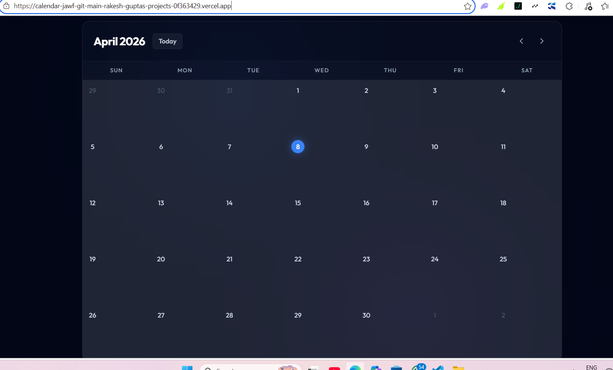
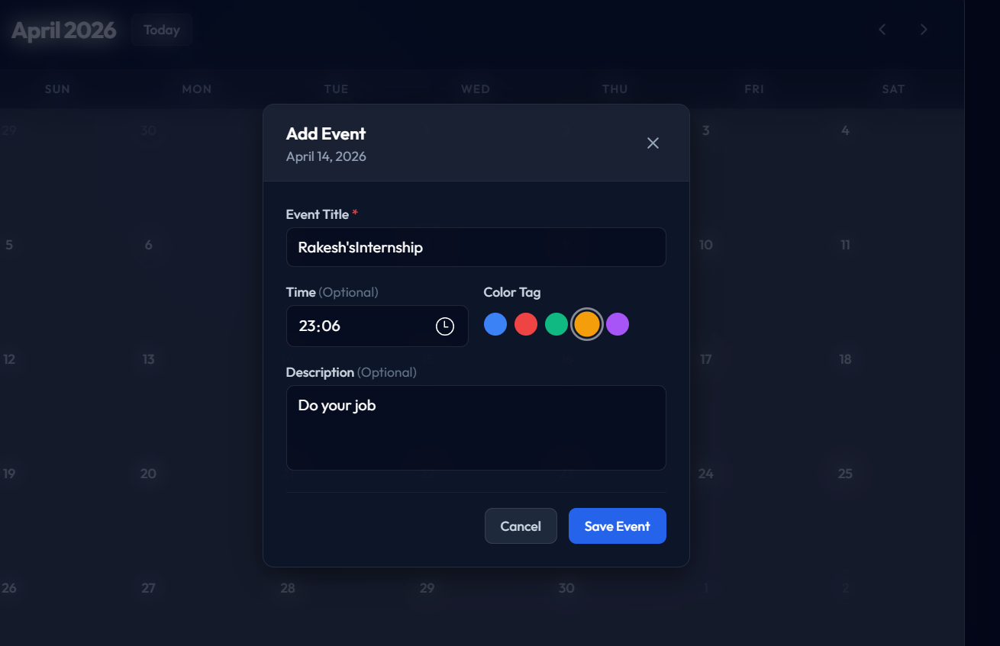

# Interactive Calendar Component 🗓️

An interactive, responsive, and modern calendar application built as part of a frontend engineering challenge. This project allows users to seamlessly navigate through months, add events, edit details, and track their schedule in a clean UI.

## 🌟 Features

- **Month Navigation**: Easily move between months and jump back to the current day.
- **Event Management**: Create, edit, and delete events with details like title, time, and description.
- **Color-Coded Events**: Assign color tags to events for easy visual categorization.
- **Persistent Data**: Events are stored securely in the browser's `localStorage` so you never lose your schedule on reload.
- **Responsive Design**: Carefully crafted to look perfect on both mobile devices and desktop screens.
- **Modern UI/UX**: Smooth hover states, polished modals, and custom scrollbars powered by Tailwind CSS.

## 🛠️ Tech Stack

- **Framework**: React 18 (with Hooks and Context API)
- **Styling**: Tailwind CSS for rapid, responsive UI development
- **Date Utility**: `date-fns` for robust date manipulation and formatting
- **Icons**: `lucide-react` for crisp SVG icons
- **Build Tool**: Vite for lightning-fast development

## 📁 Project Structure

```text
src/
├── components/          # Reusable UI components
│   ├── Calendar.jsx     # Main calendar grid logic and assembly
│   ├── DayCell.jsx      # Individual day displaying date and its events
│   ├── EventModal.jsx   # Form modal for adding/editing/deleting events
│   └── Header.jsx       # Top navigation bar (Month toggle, Today button)
├── context/
│   └── EventContext.jsx # Global state management for events and localStorage
├── lib/
│   └── utils.js         # Utility functions (e.g., Tailwind class merging)
├── App.jsx              # Main application entry component
├── index.css            # Global CSS and Tailwind directives
└── main.jsx             # React DOM rendering
```

## 🚀 Installation & Setup

To get this project up and running locally, follow these steps:

1. **Clone the repository** (or download the files):
   ```bash
   git clone https://github.com/Rakeshgupta6969/interactive-calendar.git
   cd interactive-calendar
   ```

2. **Install dependencies**:
   Make sure you have Node.js installed.
   ```bash
   npm install
   ```

3. **Start the development server**:
   ```bash
   npm run dev
   ```
   *The application will open in your default browser at: [https://calendar-jawf-git-main-rakesh-guptas-projects-0f363429.vercel.app/]

## 💡 Usage

1. **Navigate**: Use the `<` and `>` arrow icons in the top right to switch months.
2. **Jump to Today**: Click the "Today" button to instantly return to the current month.
3. **Add Event**: Click on any day cell in the calendar grid to open the Event form. Fill in the title, time, tag color, and description, then click "Save Event".
4. **Edit/Delete Event**: Click directly on an existing event pill within a calendar cell. Modify the details and click "Save Changes", or click the red "Delete" button.

## 📸 Screenshots


- **Calendar Grid View:**
  *()*

- **Event Creation Modal:**
  *()*

## 🌐 Deployment

Live Demo: [https://youtu.be/cvlZkhn0ieM]

## 🔮 Future Improvements

- **Drag & Drop Integration**: Allow users to drag an event from one day to another for quick rescheduling.
- **Weekly & Daily Views**: Provide options to switch from the monthly grid to a detailed week or day agenda.
- **Event Filtering**: Add a sidebar to filter events by their assigned color tag.
- **Recurring Events**: Support settings for events that happen weekly, monthly, or yearly.

## 👨‍💻 Author

**Rakesh Gupta**
- **GitHub**: [https://github.com/Rakeshgupta6969](https://github.com/Rakeshgupta6969)
- **LinkedIn**: [linkedin.com/in/rakesh-gupta-3aa395292](https://www.linkedin.com/in/rakesh-gupta-3aa395292)
